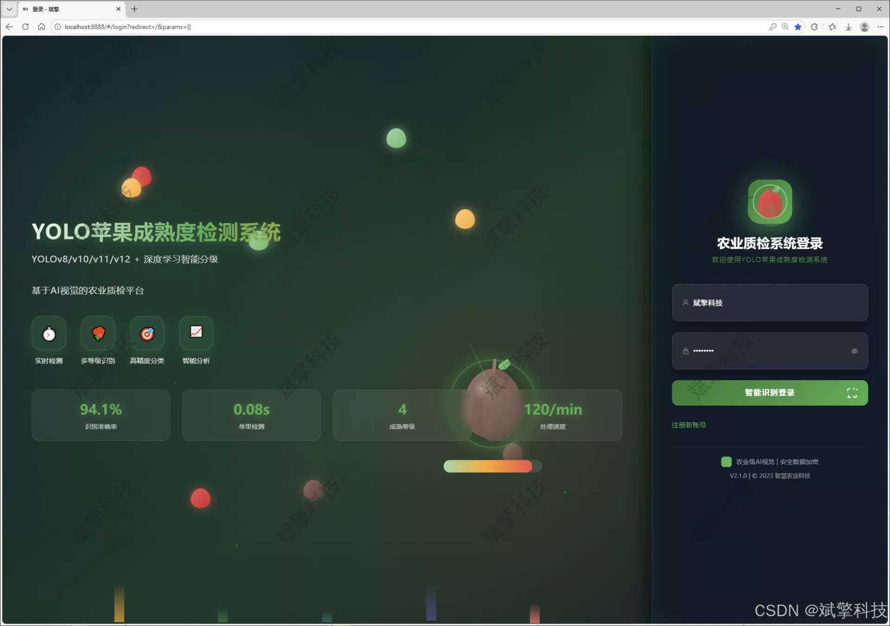
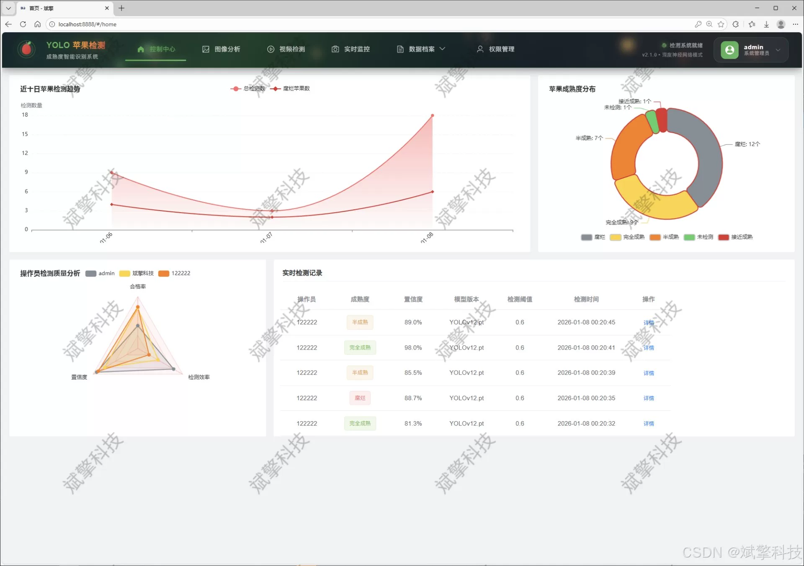
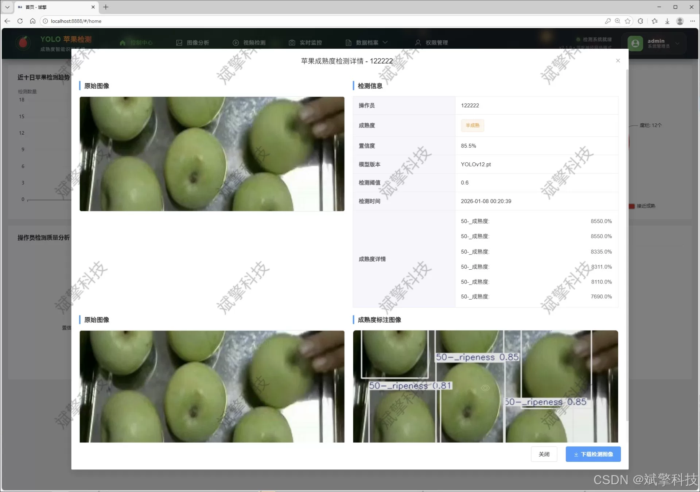
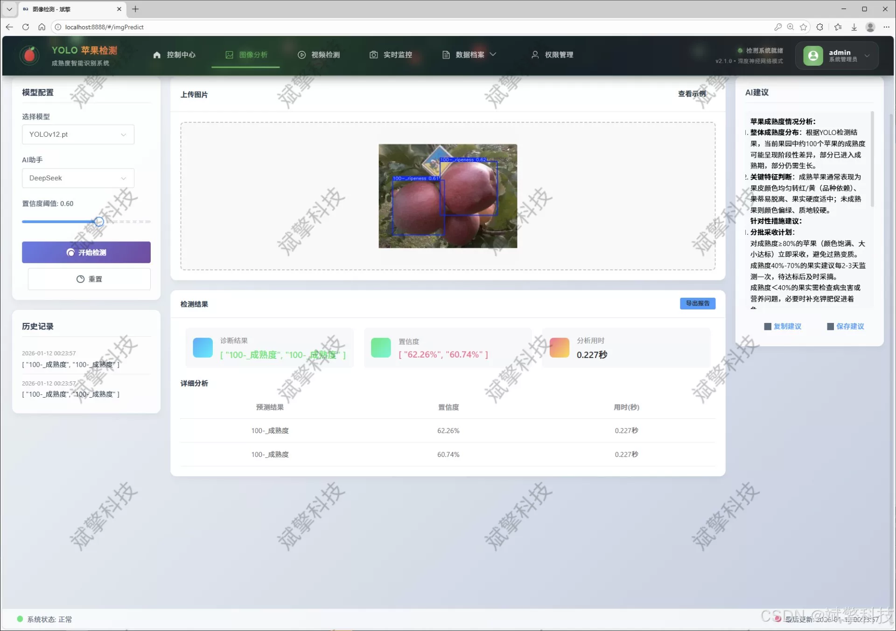
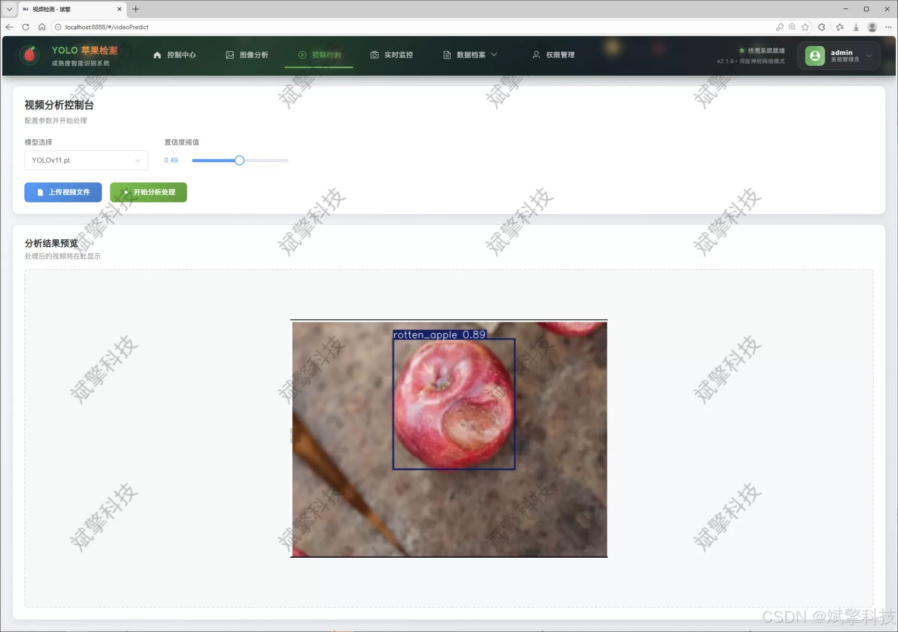
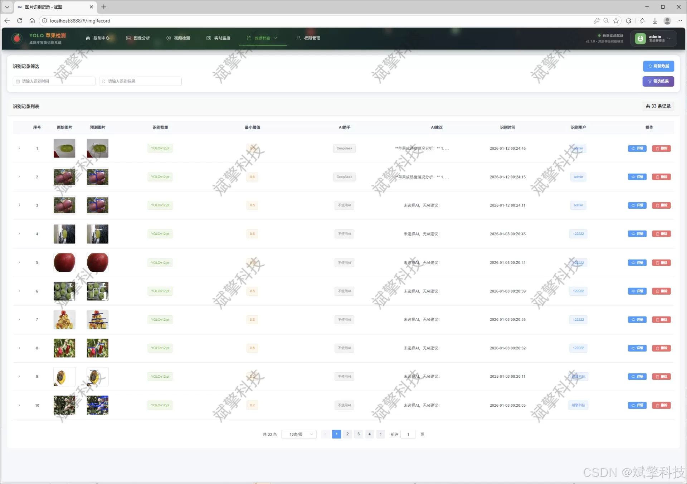
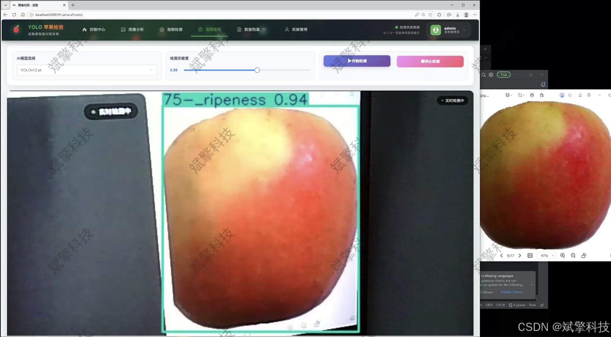
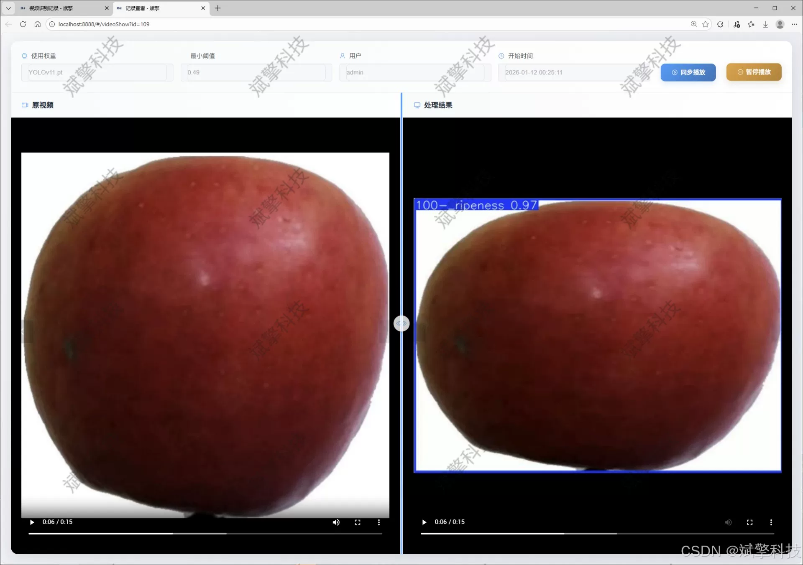
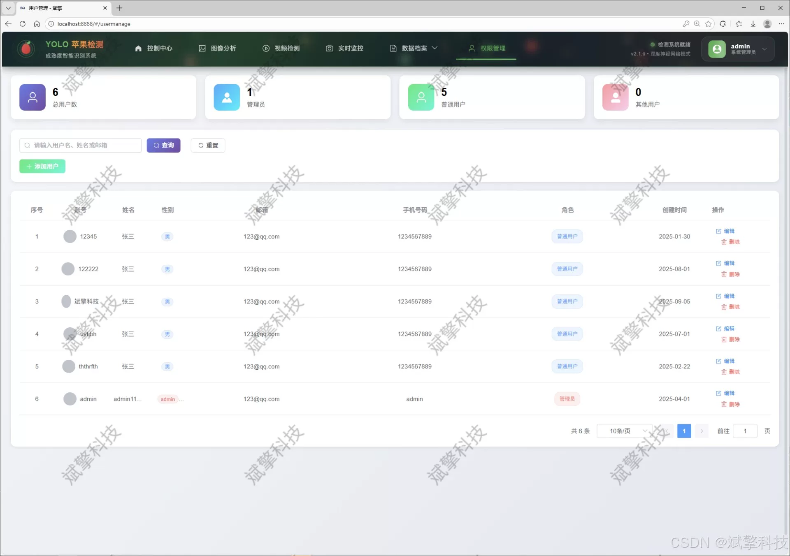

# YOLO for Apple Maturity Detection

## Body

YOLO (You Only Look Once) is a deep learning-based object detection algorithm that can quickly and accurately detect objects in real-time. It has been widely used in various fields, such as autonomous driving, medical imaging, and agriculture.

In the context of apple ripeness detection, YOLO can be used to identify the maturity level of apples based on their shape, size, and color. This can help farmers determine when to harvest their crops, which can affect the quality and taste of the apples.

The system described in the question combines YOLO with other technologies to create a comprehensive solution for apple ripeness detection. Here are the key components:

1. **DeepSeek**: A large model that can handle complex tasks such as image classification and object detection. In this case, it is used to classify the shape and size of apples, which can be used to estimate their maturity level.

2. **Web Interaction Interface**: A user-friendly interface that allows users to input images of apples and receive real-time results. This can be a simple web page or a mobile app.

3. **Backend**: The server-side code that processes the data from the DeepSeek model and sends the results back to the frontend. This could be a Python server using Flask or Django, or a Node.js server using Express.js.

4. **YOLO Data**: The training data for the YOLO model. This could be a dataset of labeled images of apples, which would need to be preprocessed and split into training and testing sets.

5. **YOLOv8/YOLOv10/YOLOv11/YOLOv12**: These are different versions of the YOLO model, each with its own set of parameters and capabilities. The choice of version depends on the specific requirements of the application.

Overall, this system combines the strengths of YOLO's speed and accuracy with the power of DeepSeek's large model and web interaction interface to provide a robust solution for apple ripeness detection.

With the rapid development of smart agriculture and precision agriculture, the automation detection and grading of fruits using computer vision technology has become a research hotspot. The traditional manual methods for determining apple maturity are inefficient, subjective, and costly. To address this issue, this study designed and implemented an intelligent detection system for apple maturity based on deep learning and Web technology. The core of this system is to integrate advanced YOLO (You Only Look Once) series object detection models (including YOLOv8, v10, v11, and v12), building a multi-level apple detection model. The system was trained and optimized on a specialized dataset containing five categories of apples: "20% ripe," "50% ripe," "75% ripe," "100% ripe," and "rotten." The aim is to achieve high accuracy and efficiency in automated recognition.

To achieve the engineering implementation and convenient interaction of technology, this system adopts a front-end separation SpringBoot + Vue.js architecture to build a comprehensive Web interaction platform with functions. The system not only supports real-time streaming media detection of images, videos, and cameras but also innovatively integrates the DeepSeek intelligent analysis model to perform semantic interpretation and report generation on detection results, enhancing the system's interpretability and practicality. All detection records, user behavior, and other key data are persistently stored in a MySQL database and dynamically displayed through rich data visualization charts to assist users in decision-making analysis. In addition, the system is equipped with a complete user permission management system, including user registration and login, personal center management, and back-end administrator control modules, ensuring the system's security and maintainability. Experimental results show that this system can effectively identify apples at different maturity stages, providing a reliable technical solution for orchard management, automated picking, and fruit quality monitoring, with high practical application value.

Functional module

✅ User Login and Registration: Supports password detection, saves to MySQL database.

✅ Supports four YOLO model switches, YOLOv8, YOLOv10, YOLOv11, YOLOv12.

✅ Information Visualization, Data Visualization.

✅ Image detection supports AI analysis functions, deepseek and Qianwen.

✅ Supports image detection, video detection, and real-time camera detection. The results are saved to a MySQL database.

✅ Picture recognition record management, video recognition record management and camera recognition record management.

✅ User Management Module, administrators can add, delete, modify, and query users.

✅ Personal center, can modify their own information, password name profile picture and so on.

There is no Lunwen writing service, nor any Lunwen.

## Images

## Payment

Here is a pay link on Stripe ( https://buy.stripe.com/3cs8yP7sY87d0vu9AB ). Please contact me lonlonago@foxmail.com after funding $89, and I will send you a complete data files , thank you!

